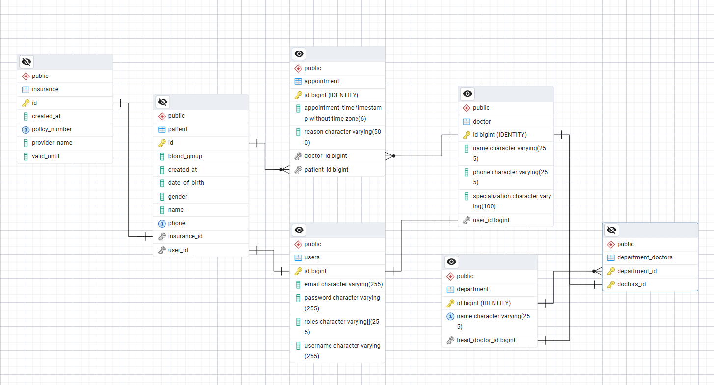

# Hospital-Management-System
Hospital Management System for internship at PearlThoughts

A comprehensive backend solution built with **Spring Boot** and **PostgreSQL** designed to digitise healthcare workflows. This system manages patient data, doctor scheduling, and medical billing with an emphasis on data integrity and RESTful architecture.

---

## 🚀 Key Features

*   **Doctor & Staff Management:** Management of specialised departments and doctor availability.
*   **Dynamic Appointment System:** Real-time scheduling with support for status updates (Scheduled, Completed, No-Show).
*   **Role-Based Security:** Secure access control using Spring Security (Admin, Doctor, Patient roles).
*   **Data Persistence:** Robust relational data storage using PostgreSQL.

---
##  📁 ER Diagram


---

## 🛠️ Tech Stack

- **Backend:** Spring Boot 3.x
- **Language:** Java 17+
- **Database:** PostgreSQL
- **Persistence:** Spring Data JPA / Hibernate
- **Security:** Spring Security (JWT-based authentication)
- **Build Tool:** Maven

---

## ⚙️ Installation & Setup

### Prerequisites
- **JDK 17** or higher
- **Maven** 3.x
- **PostgreSQL** 14+

### Step 1: Clone the Project
```bash
git clone https://github.com/james2637/Hospital-Management-System.git
cd Hospital-Management-System
```

### Step 2: Database Configuration
Create a database in PostgreSQL

Open src/main/resources/application.properties and update the credentials:
```bash
spring.datasource.url=jdbc:postgresql://localhost:5432/hms_db
spring.datasource.username=your_postgres_username
spring.datasource.password=your_postgres_password
spring.jpa.hibernate.ddl-auto=update
spring.jpa.show-sql=true
```
### Step 3: Create a .env file and add this credentials
```bash
Google_Client_ID=
Google_Client_Secret=
JwtSecretKey=
```
